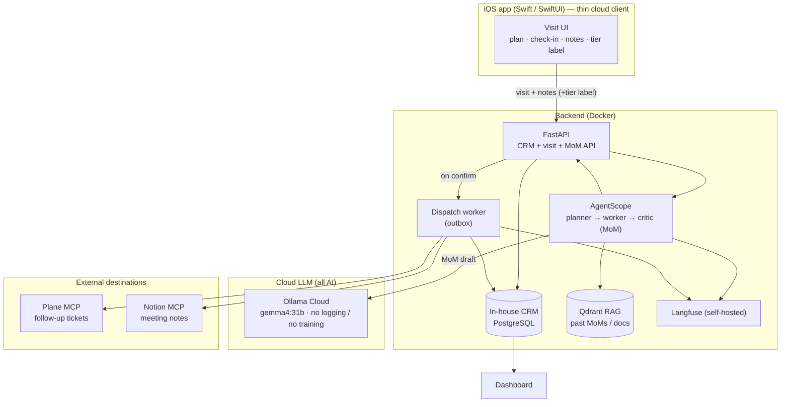
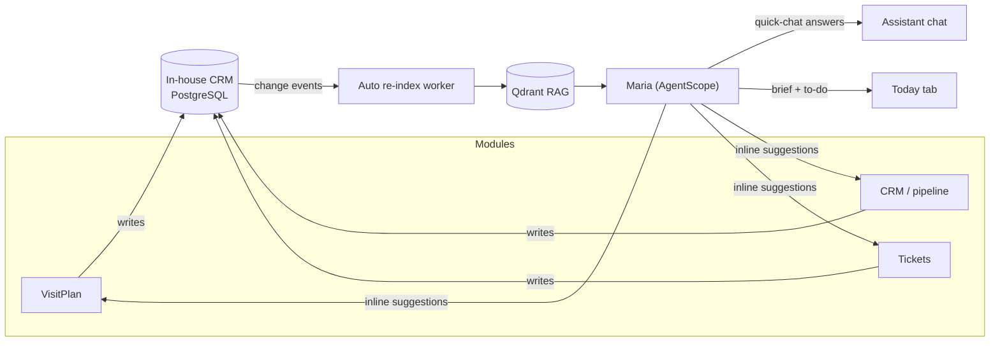
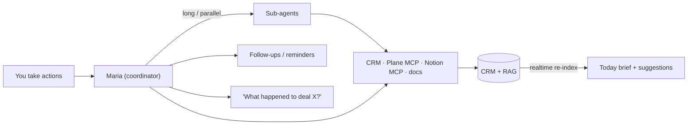
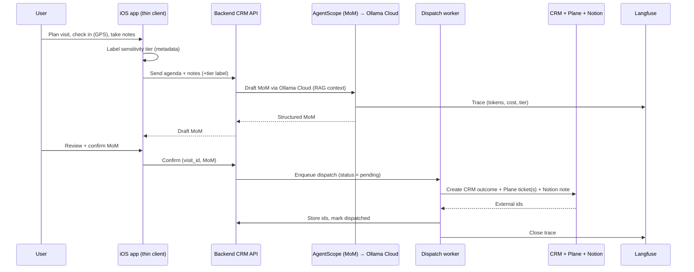

# 04 — Architecture

**Project:** Maria One

## Components

## AI coordinator (Maria)

Maria is an ambient layer over the three data modules, not a separate app. She has three jobs:

1. **Suggest** — inline, context-aware cards in each module (new visit → RFI/pipeline/follow-ups;
   new ticket → process + suggest assignee; pipeline → health flags).
2. **Answer** — a persistent quick-chat grounded in **Qdrant RAG** over all CRM data (visits, MoMs,
   clients, opportunities, tickets).
3. **Coordinate** — she reads status across modules to build the **Today** brief and to-do list.

**Auto re-indexing.** Every write to the CRM (new visit, MoM, opportunity change, ticket) emits a
change event; a re-index worker embeds the new/changed record into Qdrant so Maria's chat and
suggestions reflect it within minutes. No manual reindex step.

> Full data-store design — PostgreSQL system of record, Qdrant RAG, Redis worker pools, the
> transactional outbox, and the AI **double/triple-check + reindex** flow — is in
> [07-datastore.md](07-datastore.md).

## Orchestration (Maria + sub-agents)

Maria is the **coordinator**. For simple things she answers directly; for long or parallel work she
spawns **sub-agents** (proposal draft, quotation assembly, ticket triage, follow-up chase) and
reconciles their results before any system is updated. This maps onto AgentScope: Maria is the
planner/coordinator, sub-agents are workers, and a critic gates writes.

See [06-workflows.md](06-workflows.md) for the full deal lifecycle and per-module state machines.

## Sensitivity-tier policy

Tiers are **advisory classification/audit labels**, not a routing guarantee. All AI now runs in the
cloud via **Ollama Cloud** (no logging, no training) — there is no on-device path. The tier is set
on the phone and carried through to the trace and audit log; it no longer keeps any data on-device.

| Tier | Example | Label use |
|---|---|---|
| 🔴 1 Confidential | Banking client meeting | Flagged for review/audit; MoM still drafted in the cloud |
| 🟡 2 Internal | Internal/partner meeting | Internal classification for reporting |
| 🟢 3 Public/testing | Generic / test content | Lowest-sensitivity marker |

**Honest posture:** the previous guarantee that Tier-1 confidential data never left the device is
**gone** — all AI is cloud-side now. The privacy basis is the provider: Ollama Cloud does not log or
train on prompts. Every AI call is traced in Langfuse with its tier for audit.

## In-house CRM data model

Built in PostgreSQL, ported from `BIM.Visitplan` (replacing Cockpit). Single-user in the MVP;
`users` / roles activate in the team phase.

### Core (visit loop)

- **clients** — `id, name, sector, account_type, status, am_id, address, phone, website, notes`
- **contacts** — `id, client_id, name, email, phone, position`
- **sectors** — `id, name, owner_am_id, active`
- **visits** — `id, title, client_id, contact_id, date, start_time, end_time, location,
  agenda, status(scheduled|in_progress|completed|missed), checkin_at, checkout_at,
  checkin_lat, checkin_lng, financial_year_id, financial_quarter_id`
- **agenda_items** — `id, visit_id, title, order, completed`
- **visit_outcomes** — `id, visit_id, result(positive|neutral|negative|no_show), summary,
  next_visit_date, attachments[], submitted_at`

### MoM (greenfield — the AI value-add)

- **meeting_minutes** — `id, visit_id, attendees[], discussion, decisions[],
  next_visit_date, status(draft|confirmed), drafted_by(cloud), confirmed_at`
- **action_items** — `id, mom_id, description, owner, due_date,
  dispatched_plane_id` (replaces the old `next_action` text/regex hack)

### Sales / CRM extensions (full schema upfront)

- **opportunities** — `id, client_id, title, stage(lead|visit|qualified|proposal_tech|
  proposal_commercial|quotation|contract|won|lost), status, probability,
  pipeline_value_usd` *(real numeric field)*, `target_close_date, health(healthy|watch|at_risk),
  loss_reason, renewal_status, financial_year_id, financial_quarter_id, description`
- **deal_stage_history** — `id, opportunity_id, from_stage, to_stage, changed_by, changed_at` (audit
  of every transition; powers realtime + the lifecycle strip)
- **documents** — `id, client_id, opportunity_id, type(rfi|questionnaire|technical_proposal|
  commercial_proposal|quotation|invoice|contract|sow|kickoff), title, template_id, status(draft|
  sent|signed), body, created_at` (one row per document the lifecycle produces)
- **tickets** — `id, client_id, project_id, title, type(project|managed_service|cr), status(new|
  triaged|assigned|in_progress|review|done|blocked), assignee_id, due_date, plane_issue_id`
- **projects** — `id, client_id, opportunity_id, name, stage(handover|kickoff|sow|delivery|closure),
  status`
- **change_requests** — `id, project_id, title, status(raised|assessed|approved|rejected|scheduled|
  delivered), impact, commercial_impact_usd`
- **notes** — `id, client_id, title, body, created_by, created_at`
- **files** — `id, client_id, filename, mime, size, created_at`
- **timeline_events** — `id, client_id, item, content, parent_type, created_by, created_at`
- **financial_years**, **financial_quarters** — calendar reference tables

### Dispatch state (per visit)

Mirrors the outbox pattern: `crm_done`, `plane_done`/`plane_issue_id`,
`notion_done`/`notion_page_id`, `dispatch_error`, `attempts`, `dispatched_at`.

## MCP vs in-house placement

- **CRM → in-house.** The backend *is* the CRM (Postgres); no external CRM API.
- **Plane & Notion → MCP clients** run inside the backend, exposed to the agent/dispatch worker as
  tools.
- **The phone never speaks MCP.** It talks only to the backend CRM API. This keeps Plane/Notion
  secrets server-side and lets the dispatch worker own idempotency and retries.

## Team / multi-user (later phase)

- **users** — `id, name, email, ms_email, ms_id, role, approval_status, meeting_group,
  owned_sectors[], target_usd, team, active`
- Roles: `admin | management | sales | solution | am`; meeting groups: `infra | es | app | ms |
  account | all`. Visits gain `participants[]` for cross-department visibility.
- Microsoft Entra ID login (PKCE), reused from `BIM.Visitplan`.
