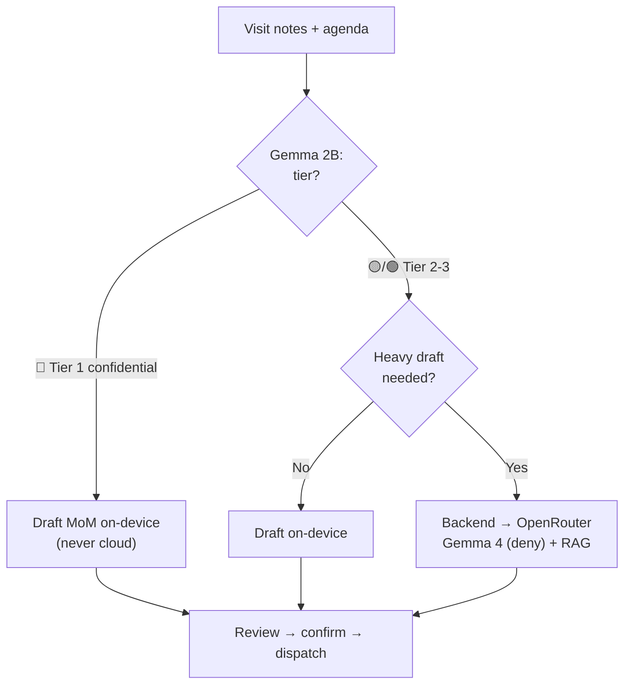

# 05 — Workflow

**Project:** Maria One

The app has four tabs — **Today · VisitPlan · CRM · Tickets** — with **Maria** coordinating across
them. You take the actions; she tracks status, suggests the next step, and answers questions.

## How a day flows

1. **Open Today.** Maria's brief summarises the day: visits, at-risk deals, tickets needing action.
   Your to-do list is AI-prioritised, and you can act on items directly (assign a ticket, draft an
   email, log a call).
2. **Work a module.** Jump into VisitPlan, CRM, or Tickets. Each shows inline Maria suggestions.
3. **Ask anytime.** Tap the floating chat icon to ask across all your data — "open MS tickets for
   Thai Bank", "which deals are at-risk?".
4. **Everything stays current.** As you add visits, deals, and tickets, they're auto re-indexed so
   Maria's answers and suggestions reflect the latest state.

## Per-module SOPs (what Maria walks you through)

**VisitPlan** — plan visit → GPS check-in → agenda → notes → **AI MoM** → review/confirm →
dispatch (CRM + Plane + Notion). Maria also suggests workflow steps: raise an **RFI**, link the
visit to a **pipeline** opportunity, set **follow-ups**.

**CRM** — add/maintain clients & opportunities. Maria continuously flags pipeline **health**
(healthy / watch / at-risk) and nudges stale deals (e.g. no activity in N days).

**Tickets** — view Plane projects + Managed-Service tickets. Create a ticket and assign it; Maria
suggests an assignee from similar past tickets, processes and stores it in the DB + RAG, and can
answer questions about any ticket.

> The full deal lifecycle (cold call → visit → pipeline → proposals → contract → won/lost →
> project/MS → delivery) and each module's state machine are documented in
> [06-workflows.md](06-workflows.md).

1. **Plan.** In the iOS app you create the visit — client, contact, date/time, and an agenda. It's
   saved to the in-house CRM as a `scheduled` visit and shows up on your "today" list.

2. **Arrive & check in.** At the client site you tap check-in. The app stamps GPS location and time
   and moves the visit to `in_progress`. You tick off agenda items as you go.

3. **Capture notes.** During or right after the meeting you jot raw notes (text now; voice later).

4. **On-device tagging (Gemma 2B).** Before anything leaves the phone, Gemma assigns a
   **sensitivity tier** (🔴 confidential / 🟡 internal / 🟢 public). Banking-client visits are
   Tier 1.

5. **Draft the MoM.** Gemma (or, for Tier 2/3, the backend) turns the agenda + raw notes into a
   structured **Minutes of Meeting**:
   - attendees,
   - discussion summary,
   - **decisions**,
   - **action items** with an owner and due date,
   - a suggested next-visit date.

   Tier 1 is drafted **entirely on-device** — no cloud. Tier 2/3 may use **OpenRouter Gemma 4 free**
   with `data_collection: "deny"`, with **Qdrant RAG** pulling the client's past MoMs/docs as context.

6. **Review & confirm.** You read the draft, fix anything, and confirm. Nothing is created in CRM,
   Plane, or Notion until you confirm.

7. **Dispatch (fan-out).** On confirm, the backend's dispatch worker writes — together — for this
   one visit:
   - a **CRM** visit outcome + opportunity update (in-house),
   - one or more **Plane** follow-up tickets (from the action items),
   - a **Notion** note (the meeting summary).

   Each call stores its external ID. If a destination is down, the worker **retries with backoff**;
   re-runs are **idempotent**, so nothing is duplicated.

8. **Trace.** MoM drafting and all three dispatch calls are recorded as a single **Langfuse** trace
   keyed by the visit — tokens, cost, latency, tier, destinations — so you can confirm confidential
   visits never touched the cloud.

9. **Observe.** The dashboard shows the visit, its MoM status, and each destination's dispatch
   status (pending / done + ID / failed).

## The key decision — where the MoM is drafted

## Team & tickets (later phase)

Once multi-user lands, the same visit data powers a **team board**: you'll view and manage your 14
members' Plane tickets, scoped by role (admin / management / sales / solution / am), with Microsoft
Entra login. The MVP stays single-user.

## Offline behavior

If the phone is offline, the visit, agenda, notes, and the on-device MoM draft are kept locally.
When connectivity returns, the visit syncs to the CRM and — once you confirm — dispatch runs the
normal fan-out → trace path.
