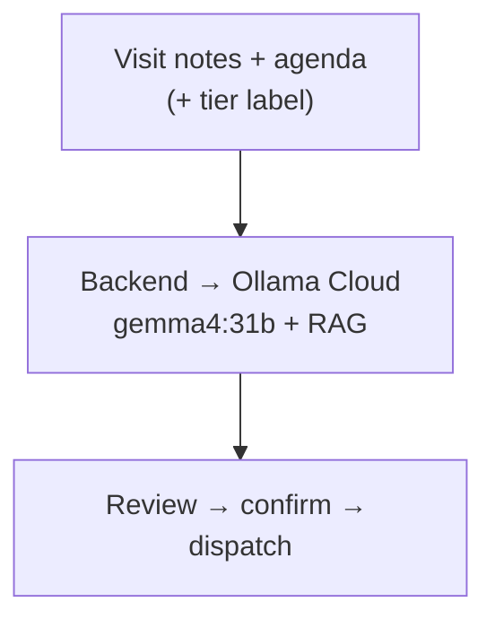

# 05 — Workflow

**Project:** Maria One

The app has four tabs — **Today · VisitPlan · CRM · Tickets** — with **Maria** coordinating across
them. You take the actions; she tracks status, suggests the next step, and answers questions.

## How a day flows

1. **Open Today.** Maria's brief summarises the day: visits, at-risk deals, tickets needing action.
   Your to-do list is AI-prioritised, and you can act on items directly (assign a ticket, draft an
   email, log a call).
2. **Work a module.** Jump into VisitPlan, CRM, or Tickets. Each shows inline Maria suggestions.
3. **Ask anytime.** Tap the floating chat icon to ask across all your data — "open MS tickets for
   Thai Bank", "which deals are at-risk?".
4. **Everything stays current.** As you add visits, deals, and tickets, they're auto re-indexed so
   Maria's answers and suggestions reflect the latest state.

## Per-module SOPs (what Maria walks you through)

**VisitPlan** — plan visit → GPS check-in → agenda → notes → **AI MoM** → review/confirm →
dispatch (CRM + Plane + Notion). Maria also suggests workflow steps: raise an **RFI**, link the
visit to a **pipeline** opportunity, set **follow-ups**.

**CRM** — add/maintain clients & opportunities. Maria continuously flags pipeline **health**
(healthy / watch / at-risk) and nudges stale deals (e.g. no activity in N days).

**Tickets** — view Plane projects + Managed-Service tickets. Create a ticket and assign it; Maria
suggests an assignee from similar past tickets, processes and stores it in the DB + RAG, and can
answer questions about any ticket.

> The full deal lifecycle (cold call → visit → pipeline → proposals → contract → won/lost →
> project/MS → delivery) and each module's state machine are documented in
> [06-workflows.md](06-workflows.md).

1. **Plan.** In the iOS app you create the visit — client, contact, date/time, and an agenda. It's
   saved to the in-house CRM as a `scheduled` visit and shows up on your "today" list.

2. **Arrive & check in.** At the client site you tap check-in. The app stamps GPS location and time
   and moves the visit to `in_progress`. You tick off agenda items as you go.

3. **Capture notes.** During or right after the meeting you jot raw notes (text now; voice later).

4. **Sensitivity labelling.** On the phone you set a **sensitivity tier**
   (🔴 confidential / 🟡 internal / 🟢 public). Banking-client visits are Tier 1. The tier is a
   classification/audit label that travels with the visit — it does not change where the AI runs.

5. **Draft the MoM.** The backend (via **Ollama Cloud**, `gemma4:31b`) turns the agenda + raw notes
   into a structured **Minutes of Meeting**:
   - attendees,
   - discussion summary,
   - **decisions**,
   - **action items** with an owner and due date,
   - a suggested next-visit date.

   All MoM drafting runs server-side in the cloud (Ollama Cloud does not log or train on prompts),
   with **Qdrant RAG** pulling the client's past MoMs/docs as context. The tier is recorded on the
   trace for audit.

6. **Review & confirm.** You read the draft, fix anything, and confirm. Nothing is created in CRM,
   Plane, or Notion until you confirm.

7. **Dispatch (fan-out).** On confirm, the backend's dispatch worker writes — together — for this
   one visit:
   - a **CRM** visit outcome + opportunity update (in-house),
   - one or more **Plane** follow-up tickets (from the action items),
   - a **Notion** note (the meeting summary).

   Each call stores its external ID. If a destination is down, the worker **retries with backoff**;
   re-runs are **idempotent**, so nothing is duplicated.

8. **Trace.** MoM drafting and all three dispatch calls are recorded as a single **Langfuse** trace
   keyed by the visit — tokens, cost, latency, tier, destinations — so you have a full audit of
   which model handled each visit and at what sensitivity tier.

9. **Observe.** The dashboard shows the visit, its MoM status, and each destination's dispatch
   status (pending / done + ID / failed).

## How the MoM is drafted

All MoM drafting runs server-side via Ollama Cloud regardless of tier; the tier rides along as an
audit label on the trace.

## Team & tickets (later phase)

Once multi-user lands, the same visit data powers a **team board**: you'll view and manage your 14
members' Plane tickets, scoped by role (admin / management / sales / solution / am), with Microsoft
Entra login. The MVP stays single-user.

## Offline behavior

If the phone is offline, the visit, agenda, and notes are kept locally. MoM drafting needs the
backend (Ollama Cloud), so it waits until connectivity returns; the visit then syncs to the CRM,
the MoM is drafted server-side, and — once you confirm — dispatch runs the normal fan-out → trace
path.
