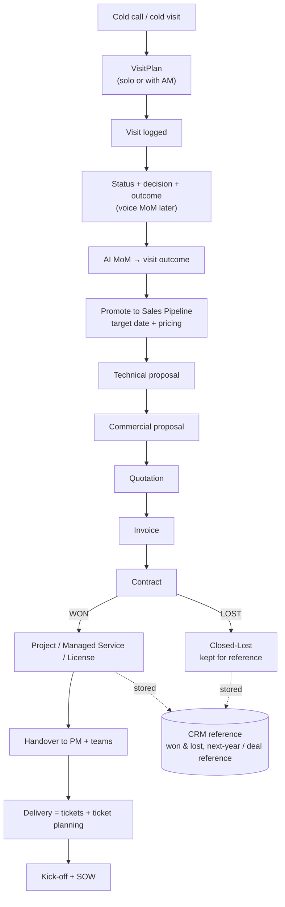
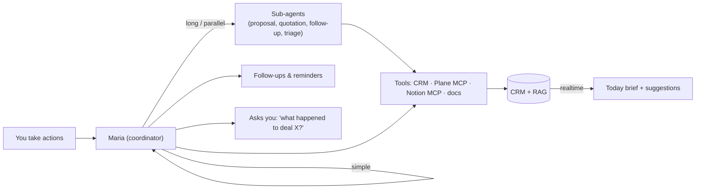

# 06 — Workflows & Orchestration

**Project:** Maria One

Maria coordinates a set of **realtime workflows**. You act at each step; she tracks status, suggests
the next action, follows up, and updates every system. She can **act herself** or **call sub-agents**
(an agentic flow) for longer tasks — e.g. drafting a proposal while you keep working.

## The deal lifecycle (end to end)

**Documents produced along the way:** RFI · Questionnaire · Kick-off · SOW (plus technical/commercial
proposal, quotation, invoice, contract). Maria knows which document each stage needs and can prepare
drafts.

## Module workflows (state machines)

### Sales / pipeline

`Lead → Visit → Qualified → Proposal (tech) → Proposal (commercial) → Quotation → Contract →
Won | Lost`

- Maria flags **health** (healthy / watch / at-risk) from activity recency, stage age, and outcome.
- On a won deal she opens the **delivery** track (Project/MS/License). On lost, she archives it as a
  reference with the loss reason.
- Realtime: stage changes anywhere update the pipeline and the Today brief instantly.

### Ticket workflow (Plane projects + Managed Service)

`New → Triaged → Assigned → In progress → Review → Done` (+ `Blocked`)

- New tickets are processed, stored in the CRM DB, and indexed into RAG.
- Maria suggests an **assignee** from similar past tickets and drafts the ticket body.
- You can ask for a specific ticket or a client's open tickets at any time.

### Change Request (CR) workflow

`Raised → Impact assessed → Approved | Rejected → Scheduled → Delivered`

- Linked to a project/contract; Maria checks scope vs SOW and flags commercial impact.

### Projects workflow

`Won → Handover → Kick-off → SOW signed → Delivery (tickets) → Closure`

- Handover packet assembled from the deal (MoMs, proposal, contract). Kick-off + SOW tracked as
  gated steps.

### Managed Service (MS) workflow

`Onboard → License activate → Run (SLA) → Renewal`

- SLA breaches and upcoming renewals surface on Today; renewal becomes a new pipeline opportunity.

## Orchestration model (Maria + sub-agents)

- **Coordinator (Maria).** Owns the conversation, decides whether to answer directly or delegate.
- **Sub-agents.** Spawned for multi-step jobs (draft a proposal, assemble a quotation, chase an
  approval). They report back; Maria reconciles and updates the CRM.
- **Follow-up loop.** Maria proactively asks about stale deals ("what happened to deal X?") and
  records your answer across the right systems.
- **Realtime suggestions.** Every CRM write is re-indexed, so her next suggestion reflects the
  latest and greatest state.

## How this maps to the build

- The lifecycle stages become **status/stage fields** on `opportunities`, `projects`, `tickets`,
  and a `deal_stage` history table (audit of stage transitions).
- Each document type (RFI, questionnaire, proposal, quotation, invoice, contract, SOW, kick-off) is
  a record under the client/opportunity with a template + generated draft.
- Orchestration uses the **AgentScope** planner/worker/critic: Maria is the planner/coordinator;
  sub-agents are workers; the critic checks before any system is updated.
