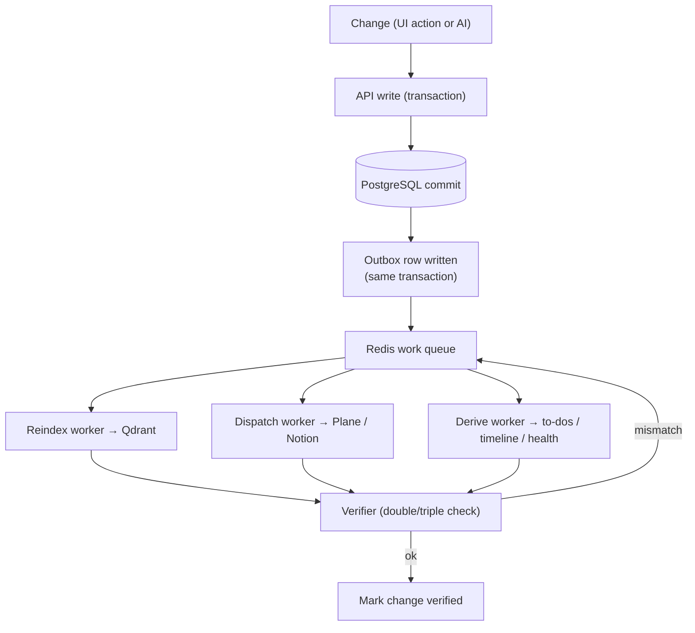
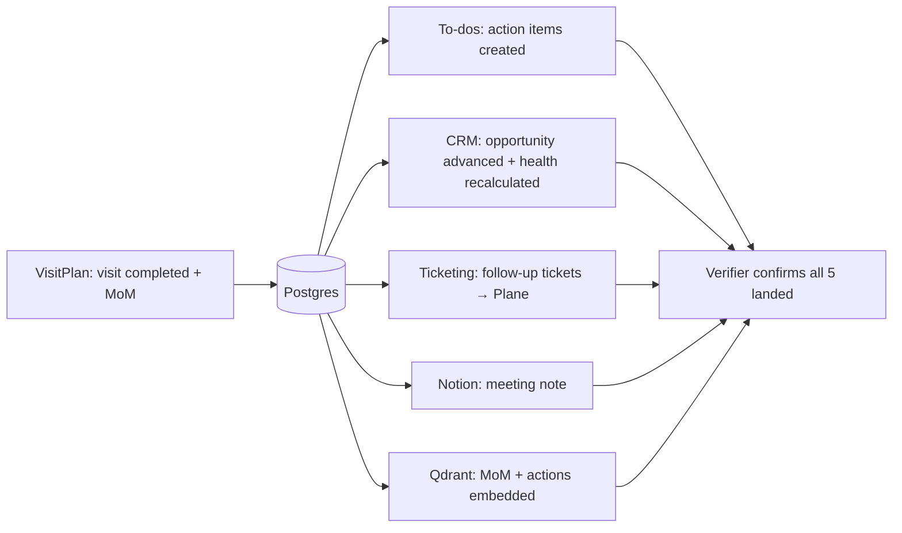

# 07 — Data Store, Workload & Reindex

**Project:** Maria One

This describes how data is stored, how work is distributed, and how the AI **double/triple-checks**
that every change is persisted and re-indexed across all surfaces: **CRM, To-dos, VisitPlan,
Ticketing, and Notion**.

## Stores at a glance

| Store | Tech | Holds | Role |
|---|---|---|---|
| **System of record** | PostgreSQL | Clients, contacts, visits, MoMs, opportunities (+stage history), tickets, projects, CRs, to-dos, documents, timeline | The single source of truth |
| **Knowledge / RAG** | Qdrant | Embeddings of MoMs, notes, docs, tickets, deals | Semantic search + Maria's grounding |
| **Cache / queue / locks** | Redis | Job queues, idempotency keys, rate limits, distributed locks, recent-state cache | Coordinates async workload |
| **External mirrors** | Plane, Notion | Tickets (Plane), notes/pages (Notion) | Downstream copies, linked by id |
| **Object storage** | S3-compatible | Attachments, proposals, contracts, SOW files | Files referenced from Postgres |

> Postgres is authoritative. Qdrant, Redis, Plane and Notion are **derived** — they can always be
> rebuilt from Postgres, which is what makes triple-check + reindex safe.

## The change pipeline (every write goes through this)

Any change — from you in the app, or from Maria/sub-agents — follows one path so nothing is lost:

**Transactional outbox.** The DB write and an `outbox` row are committed in the **same Postgres
transaction**. A change can never be acknowledged without its follow-up work being queued — no lost
updates even if a worker crashes.

## Workload distribution (organised, not overloaded)

Work is split into **dedicated worker pools**, each draining its own Redis queue so a slow external
API can't block indexing or the UI:

| Worker pool | Job | Scales on |
|---|---|---|
| **API workers** | Handle UI/AI requests, commit writes + outbox | Request volume |
| **Reindex workers** | Embed changed records → Qdrant | Write throughput |
| **Dispatch workers** | Push to Plane / Notion (rate-limited, retried) | External API limits |
| **Derive workers** | Recompute to-dos, timeline, pipeline health, SLA flags | Change fan-out |
| **Agent workers** | Run Maria + sub-agents (MoM draft, proposal, triage) | Concurrent agent tasks |
| **Verifier workers** | Re-read and confirm each change landed everywhere | Backlog size |

Coordination primitives in Redis: **idempotency keys** (dedupe), **per-entity locks** (no two
workers touch the same deal at once), **priority lanes** (SLA-risk + user-facing first), and
**exponential-backoff retries** with a dead-letter queue.

## AI double / triple check

Maria never trusts a single write. For each change the **Verifier** runs up to three checks before
marking it `verified`; failures requeue automatically.

1. **Check 1 — DB persisted.** Re-read the row from Postgres; confirm fields + version match what
   was submitted.
2. **Check 2 — RAG indexed.** Query Qdrant for the record's id/hash; confirm the embedding exists
   and its `content_hash` matches the current DB row (so stale vectors are caught and re-embedded).
3. **Check 3 — Mirrors in sync.** For tickets/notes, read back the Plane/Notion item by stored id;
   confirm status/content match. Mismatch → re-dispatch.

A change is only shown as **done** in the UI once all relevant checks pass. The Today brief surfaces
anything stuck (`pending_verification`) so it's never silently dropped.

## Reindexing the knowledge base

- **Incremental (default).** Each change re-embeds just the affected record (cheap, seconds).
- **Content-hash guard.** Every indexed vector stores the source `content_hash`; the verifier
  re-embeds whenever DB hash ≠ vector hash, so edits never leave stale knowledge.
- **Scheduled sweep.** A periodic job scans for `content_hash` drift and any `outbox` rows not yet
  `verified`, and replays them.
- **Full rebuild.** Because Postgres is authoritative, Qdrant can be dropped and rebuilt from the DB
  at any time (disaster recovery, embedding-model upgrade).

## Cross-surface consistency (CRM · To-dos · VisitPlan · Ticketing · Notion)

A single business event usually touches several surfaces. Example — a visit is completed:

All five derive from the same committed transaction and the same outbox, so they stay consistent;
the verifier guarantees each one actually landed and is re-indexed.

## How this maps to the build

- Add an `outbox` table (`id, aggregate, aggregate_id, event, payload, status, attempts,
  verified_at`) written in-transaction with every change.
- Stand up Redis with named queues per worker pool + a dead-letter queue.
- Reindex/dispatch/derive/verify workers are AgentScope tools/jobs; the **Verifier** is a small
  critic-style agent that gates `verified`.
- Every Qdrant vector carries `source_id` + `content_hash` for drift detection.
- Self-hosted **Langfuse** traces each change end-to-end (commit → index → dispatch → verify) so you
  can see exactly where anything stalls.
